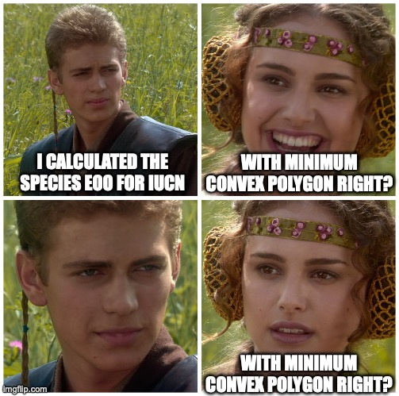

# Arhropoda species assessment in Crete island

## Structure of the repo

This repository is structured as follows:
```
|-- data
|-- scripts
|-- results
|-- plots
|-- figures

```

In the `data` directory are the occurrence data (xlsx files) and 
the spatial data required for this analysis.

## Dependencies

This analysis is implemented in R version 4.2.2 (2022-10-31) and 
requires the following packages:

```
# for analysis

-- tidyverse
-- sf
-- raster
-- ConR

# for visualisation

-- ggplot2
-- ggarrange
-- ggnewscale
-- ggrepel
-- ggpubr
-- jpeg

```

## Scripts

First the script `species_assessment.R` is executed. It is the main
script that calculates the IUCN AOO and EOO and PACA metrics. Then the 
`spatial_analysis.R` script finds all the overlaps between the species metrics
and spatial data. These 2 scripts generate all the 
results. Subsequently, the `species_assessment_statistict.Rmd`
R markdown file generates a report based on these results. The `functions.R` is a 
collection of functions required in all scripts.

The script `code_snippets.R` contains code and data manipulation of large
files, e.g. Natura2000 sites, elevation maps of Europe. This script is not
meant to be executed but to guide to the original versions of the data as
downloaded from the sources. 

The script `get_species_info.R` is used for exploratory analysis of the
GBIF information of the species in our dataset and for the current IUCN assessments
of arthropod species.

In `publication_figures.R` we produce the figures and supplementary figures for the publications.
All figures use the color-blind friendly palette Okabe-Ito.

## Occurrence Data

Occurrences of endemic arthropod species in the island of Crete were 
compiled by Natural History Museaum of Crete. The data were cureted
from the literature and from Natural History Museaum of Crete specimens.

## Spatial data

The protected areas of [Natura2000 SCI](https://www.eea.europa.eu/data-and-maps/data/natura-14)
(habitats directive) and [Wildlife refugees](https://www.protectedplanet.net/en/thematic-areas/wdpa?tab=WDPA)
are used in this analysis. 

Spatial data from Copernicus system are also used. These are the 
[CORINE Land Cover](https://land.copernicus.eu/pan-european/corine-land-cover/clc2018?tab=download)
and the [Digital Elevation Models](https://www.eea.europa.eu/data-and-maps/data/copernicus-land-monitoring-service-eu-dem).
CORINE Land Cover data are used to identify human pressures on the Natura2000
regions and on the hotspots of the arthropod endemic taxa.

## Assessment

Full IUCN assessments of the species are downloaded from the [IUCN web resource](https://www.iucnredlist.org).
In advanced search, the Taxonomy, Land regions and Filter on Endemics fields are 
used to download data. We use the World, Europe, Greece Land regions and 
endemics to download "Search Results" of 3 different datasets. Crete endemics are not included
in the IUCN assessment so we filter from our curated Cretan endemics. These data
are used to compare with our preliminary analysis.

The assessment of taxa is based on the critirion B of IUCN; Extend of 
Occurrence and Area of Occupancy. All the results of this analysis is 
visualised in the `plots` directory.

Preliminary Automated Conservation Assessments (PACA) is based on 
critirion B. It is a fast way to estimated the taxa under threat.



## Hotspots

Using the [European Environment Agency reference grid](https://www.eea.europa.eu/data-and-maps/data/eea-reference-grids-2) 
of 10km X 10km we defined a location as a cell grid that a species has occurrered. 
The endemic hotspots and the threatened hotspots are the cell grids 
the 10% highest endemic species and threatened species, respectively.

## Citation

Giannis Bolanakis, Savvas Paragkamian, Maria Chatzaki, Liubitsa Kardaki and Apostolos Trichas. 2023.
The conservation status of the Cretan Endemic Arthropods under Natura 2000 network.

